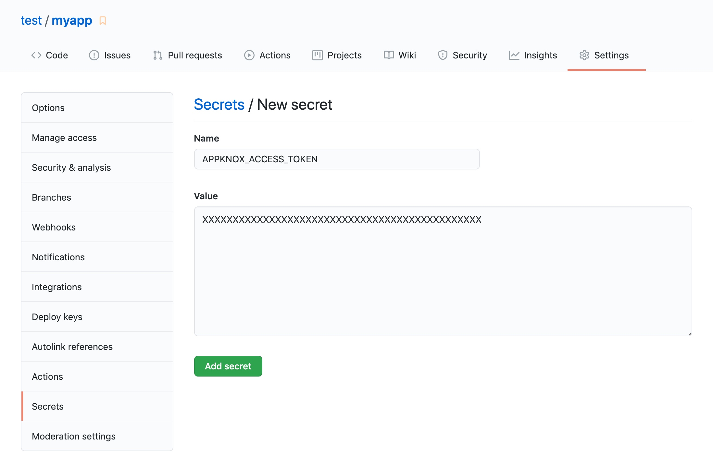

# Appknox Github Action

The Appknox Github action allows you to perform Appknox security scan on your mobile application binary. The APK/IPA built from your CI pipeline will be uploaded to Appknox platform which performs static scan and the build will be errored according to the chosen risk threshold.

## How to use it?

### Step 1: Get your Appknox access token

Sign up on [Appknox](https://appknox.com).

Generate a personal access token from <a href="https://secure.appknox.com/settings/developersettings" target="_blank">Developer Settings</a>

### Step 2: Configure Appknox access token in your app's GitHub repository

Go to your app's repository settings in Github, click on Secrets in sidebar and create a new secret with name `APPKNOX_ACCESS_TOKEN` and value with the access token obtained in step 1



### Step 3: Configure the GitHub action

In your Github action workflow file (eg: `.github/workflows/build.yml`), insert the following content after the app build step:
```yml
- name: Appknox Scan
  uses: appknox/appknox-github-action@1.0.0
  with:
    appknox_access_token: ${{ secrets.APPKNOX_ACCESS_TOKEN }}
    file_path: app/build/outputs/apk/debug/app-debug.apk
    risk_threshold: HIGH
```

## Inputs

| Key                     | Value                        |
|-------------------------|------------------------------|
| `appknox_access_token`  | Personal access token secret |
| `file_path`             | File path to the mobile application binary to be uploaded |
| `risk_threshold`        | Risk threshold value for which the CI should fail. <br><br>Accepted values: `CRITICAL, HIGH, MEDIUM & LOW` <br><br>Default: `LOW` |

---

Example:
```yml
name: Build
on:
  push:
    branches:
      - master
jobs:
  build:
    runs-on: ubuntu-latest
    steps:
    - uses: actions/checkout@v2
    - name: Set up JDK 1.8
      uses: actions/setup-java@v1
      with:
        java-version: 1.8
    - name: Grant execute permission for gradlew
      run: chmod +x gradlew
    - name: Build the app
      run: ./gradlew build
    - name: Appknox GitHub action
      uses: appknox/appknox-github-action@1.0.0
      with:
        appknox_access_token: ${{ secrets.APPKNOX_ACCESS_TOKEN }}
        file_path: app/build/outputs/apk/debug/app-debug.apk
        risk_threshold: MEDIUM
```

