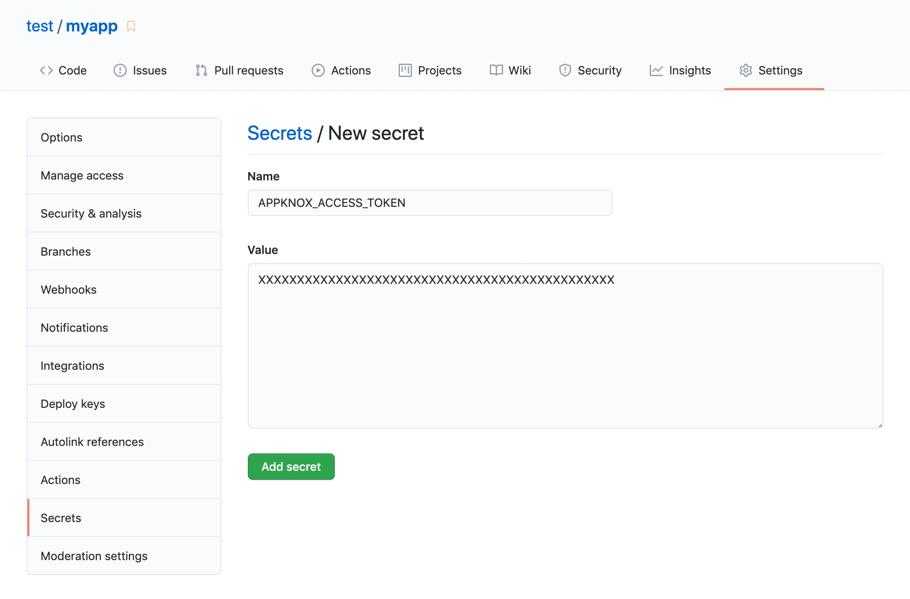
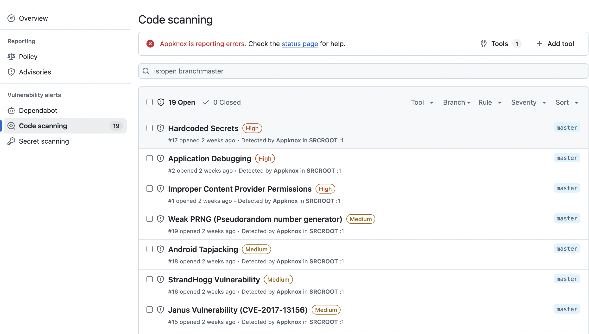

# Appknox Github Action

The Appknox Github action allows you to perform Appknox security scan on your mobile application binary. The APK/IPA built from your CI pipeline will be uploaded to Appknox platform which performs static scan and the build will be errored according to the chosen risk threshold or health score.

## How to use it?

### Step 1: Get your Appknox access token

Sign up on [Appknox](https://appknox.com).

Generate a personal access token from <a href="https://secure.appknox.com/settings/developersettings" target="_blank">Developer Settings</a>

### Step 2: Configure Appknox access token in your app's GitHub repository

Go to your app's repository settings in Github, click on Secrets in sidebar and create a new secret with name `APPKNOX_ACCESS_TOKEN` and value with the access token obtained in step 1



### Step 3: Configure the GitHub action

In your Github action workflow file (eg: `.github/workflows/build.yml`), insert the following content after the app build step:
```yml
- name: Appknox Scan
  uses: appknox/appknox-github-action@1.1.2
  with:
    appknox_access_token: ${{ secrets.APPKNOX_ACCESS_TOKEN }}
    file_path: app/build/outputs/apk/debug/app-debug.apk
    risk_threshold: HIGH
```

## Inputs

| Key                     | Value                        |
|-------------------------|------------------------------|
| `appknox_access_token`  | Personal access token secret |
| `file_path`             | File path to the mobile application binary to be uploaded |
| `risk_threshold`        | Minimum risk level to fail CI. Mutually exclusive with `health_score` — exactly one must be provided. <br><br>Accepted values: `CRITICAL, HIGH, MEDIUM & LOW` |
| `health_score`          | Minimum health score (0–100) required to pass CI. Mutually exclusive with `risk_threshold` — exactly one must be provided. <br><br>Accepted values: `0` to `100` |
| `sarif`                 | Enables SARIF report generation. <br><br>Accepted values: `Enable & Disable` <br><br>Default: `Disable` |
| `sast_timeout`          | Static scan timeout duration in minutes. <br><br>Default: `30` |
| `trigger_knoxiq`        | Requests KnoxIQ triage for the uploaded build. KnoxIQ results are reflected by the CI check. <br><br>Accepted values: `true`, `false` <br><br>Default: `false` |
| `generate_pdf_report`   | Downloads a password-protected PDF report and its password file after the CI check. Report failures are warnings and do not replace the CI check result. <br><br>Accepted values: `true`, `false` <br><br>Default: `false` |

## Outputs

| Key                              | Value |
|----------------------------------|-------|
| `pdf_report_path`                | Absolute path to the downloaded PDF report when report generation succeeds |
| `pdf_report_password_path`       | Absolute path to the downloaded report password file when report generation succeeds |

---

## Examples:

### Running Appknox Scan for Vulnerability Detection (using risk_threshold)
```yml
name: Build
on:
  push:
    branches:
      - master
jobs:
  build:
    runs-on: ubuntu-latest
    steps:
    - uses: actions/checkout@v2
    - name: Set up JDK 1.8
      uses: actions/setup-java@v1
      with:
        java-version: 1.8
    - name: Grant execute permission for gradlew
      run: chmod +x gradlew
    - name: Build the app
      run: ./gradlew build
    - name: Appknox GitHub action
      uses: appknox/appknox-github-action@1.1.2
      with:
        appknox_access_token: ${{ secrets.APPKNOX_ACCESS_TOKEN }}
        file_path: app/build/outputs/apk/debug/app-debug.apk
        risk_threshold: MEDIUM
```
### Running Appknox Scan with Health Score
_This example uses `health_score` to fail CI when the app's security score drops below the specified threshold._
```yml
name: Build
on:
  push:
    branches:
      - master
jobs:
  build:
    runs-on: ubuntu-latest
    steps:
    - uses: actions/checkout@v2
    - name: Set up JDK 1.8
      uses: actions/setup-java@v1
      with:
        java-version: 1.8
    - name: Grant execute permission for gradlew
      run: chmod +x gradlew
    - name: Build the app
      run: ./gradlew build
    - name: Appknox GitHub action
      uses: appknox/appknox-github-action@1.1.2
      with:
        appknox_access_token: ${{ secrets.APPKNOX_ACCESS_TOKEN }}
        file_path: app/build/outputs/apk/debug/app-debug.apk
        health_score: 70
```
### Appknox Scan with Downloadable SARIF File
_This example demonstrates how to run Appknox Scan to generate a SARIF report and download it as an artifact._
```yml
    name: Build
    on:
      push:
        branches:
          - master
    jobs:
      build:
        runs-on: ubuntu-latest
        steps:
        - uses: actions/checkout@v2
        - name: Set up JDK 1.8
          uses: actions/setup-java@v1
          with:
            java-version: 1.8
        - name: Grant execute permission for gradlew
          run: chmod +x gradlew
        - name: Build the app
          run: ./gradlew build
        - name: Appknox GitHub action
          uses: appknox/appknox-github-action@1.1.2
          with:
            appknox_access_token: ${{ secrets.APPKNOX_ACCESS_TOKEN }}
            file_path: app/build/outputs/apk/debug/app-debug.apk
            risk_threshold: MEDIUM
            sarif: Enable
        - name: Download SARIF Report
          if: always()
          uses: actions/upload-artifact@v2
          with:
            name: sarif-report
            path: report.sarif
```
### Appknox Scan with KnoxIQ and a Downloadable PDF Report

The action downloads the PDF and password file to `reports/<file-id>/`. Use the
output paths with `actions/upload-artifact` to retain them after the job. The
`always()` condition allows a successfully generated report to be uploaded even
when the Appknox vulnerability gate fails the scan step.

```yml
    - name: Appknox Scan
      id: appknox-scan
      uses: appknox/appknox-github-action@1.2.1
      with:
        appknox_access_token: ${{ secrets.APPKNOX_ACCESS_TOKEN }}
        file_path: app/build/outputs/apk/debug/app-debug.apk
        risk_threshold: HIGH
        trigger_knoxiq: true
        generate_pdf_report: true

    - name: Upload Appknox PDF report
      if: always() && steps.appknox-scan.outputs.pdf_report_path != ''
      uses: actions/upload-artifact@v4
      with:
        name: appknox-reports
        path: |
          ${{ steps.appknox-scan.outputs.pdf_report_path }}
          ${{ steps.appknox-scan.outputs.pdf_report_password_path }}
```

### Upload Appknox Scan Report to GitHub Code Scanning
**Note:** _For integrating with GitHub Advanced Security (GHAS), ensure you have an active GitHub account with the Advanced Security feature enabled._

```yml
    name: Build
    on:
      push:
        branches:
          - master
    jobs:
      build:
        runs-on: ubuntu-latest
        steps:
        - uses: actions/checkout@v2
        - name: Set up JDK 1.8
          uses: actions/setup-java@v1
          with:
            java-version: 1.8
        - name: Grant execute permission for gradlew
          run: chmod +x gradlew
        - name: Build the app
          run: ./gradlew build
        - name: Appknox GitHub action
          uses: appknox/appknox-github-action@1.1.2
          with:
            appknox_access_token: ${{ secrets.APPKNOX_ACCESS_TOKEN }}
            file_path: app/build/outputs/apk/debug/app-debug.apk
            risk_threshold: MEDIUM
            sarif: Enable
        - name: Upload SARIF to GHAS
          if: always()
          uses: github/codeql-action/upload-sarif@v3
          with:
            sarif_file: report.sarif
```
**View reported vulnerabilities in GitHub Code Scanning after running above workflow**


